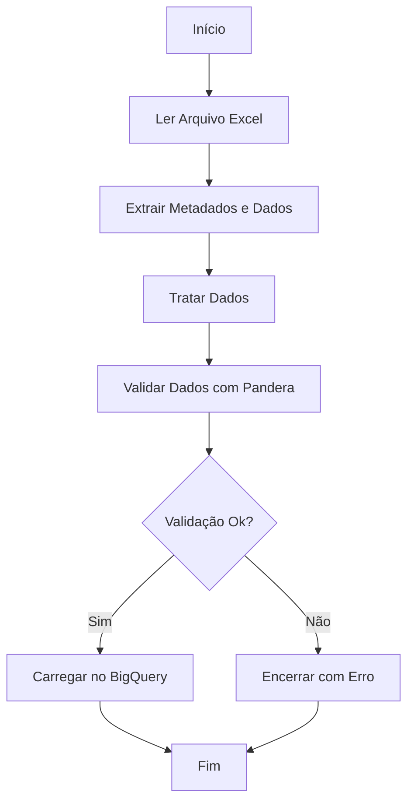

# Visão Geral

Este projeto tem o objetivo de realizar um processo de ETL, no qual irá extrair de dados a partir de arquivos Excel, transformá-los de acordo com regras de negócio e, por fim, carregá-los no **Google BigQuery**.

O pipeline executa as seguintes etapas:

1. Leitura de arquivos Excel;
2. Extração de metadados (data da avaliação e revisor);
3. Transformação dos dados:
   - Unpivot dos dados;
   - Cálculo de pesos percentuais;
   - Validação de schema;
4. Carga no Google BigQuery.

---

## Fluxo do Processo

---

## Documentação das Funções

---

### `capturar_erros`

**Descrição:**  
Decorador utilizado para capturar erros durante a execução das funções do pipeline. Se houver qualquer erro, ele será registrado num log e o processo será encerrado.

**Parâmetros:**  
- `funcao` (*function*): função que será monitorada.

**Retorno:**  
- Retorna a função original encapsulada com o tratamento de erros.

---

### `ler_arquivo`

**Descrição:**  
Lê um arquivo Excel e extrai tanto os dados tabulares quanto os metadados (Data da Avaliação e Revisor).

**Parâmetros:**  
- `caminho` (*str*): Caminho do arquivo Excel.
- `aba` (*str*): Nome da aba do Excel a ser lida.
- `coluna_dados` (*str*): Nome do cabeçalho que identifica o início dos dados tabulares.

**Retorno:**  
- (*dict*) Dicionário contendo:
  - `DATA_AVALIACAO` (*datetime.date*): Data da avaliação;
  - `REVISOR` (*str*): Nome do revisor;
  - `DADOS` (*pd.DataFrame*): Dados da tabela;
  - `CAMINHO` (*str*): Caminho do arquivo.

---

### `tratar_dataframe`

**Descrição:**  
Realiza o tratamento dos dados por meio das ações de:

- Geração dos pesos percentuais de cada agente;
- Unpivot dos dados de avaliação;
- Merge dos dados de avaliação com os pesos percentuais;
- Inclusão dos metadados (data da avaliação e revisor);
- Validação conforme o schema definido;
- Geração do nome da tabela de destino.

**Parâmetros:**  
- `conteudo` (*dict*): Dicionário retornado pela função `ler_arquivo`.
- `colunas_base` (*list*): Lista de colunas fixas no unpivot.
- `colunas_valores` (*list*): Lista de colunas a serem transformadas em linhas no unpivot.
- `nome_tabela` (*dict*): Dicionário de mapeamento entre o caminho do arquivo e o nome base da tabela no BigQuery.

**Retorno:**  
- (*tuple*) com:
  - `nome_arquivo` (*str*): Nome da tabela no BigQuery (incluindo a data no sufixo).
  - `df_tabela_dados` (*pd.DataFrame*): DataFrame tratado e validado.

---

### `carregar_dados_bigquery`

**Descrição:**  
Carrega um DataFrame para uma tabela no **Google BigQuery**, sobrescrevendo-a caso já exista.

**Parâmetros:**  
- `dataframe` (*pd.DataFrame*): Dataframe contendo dados tratados e validados.
- `nome_tabela` (*str*): Nome da tabela de destino no BigQuery.

**Retorno:**  
- (*None*)  
Obs.: Após a carga de dados há um log, indicando o número de linhas carregadas.